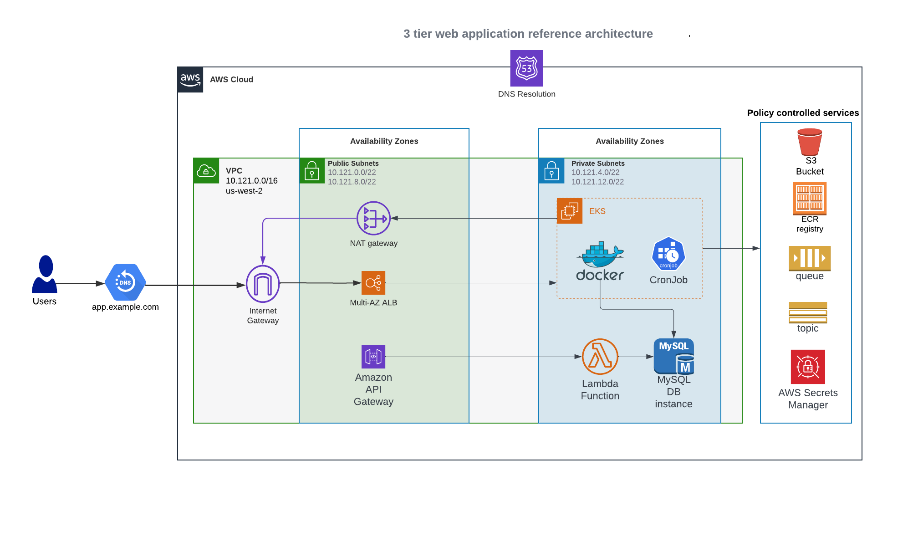
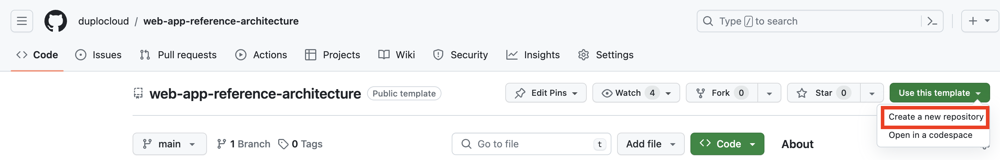
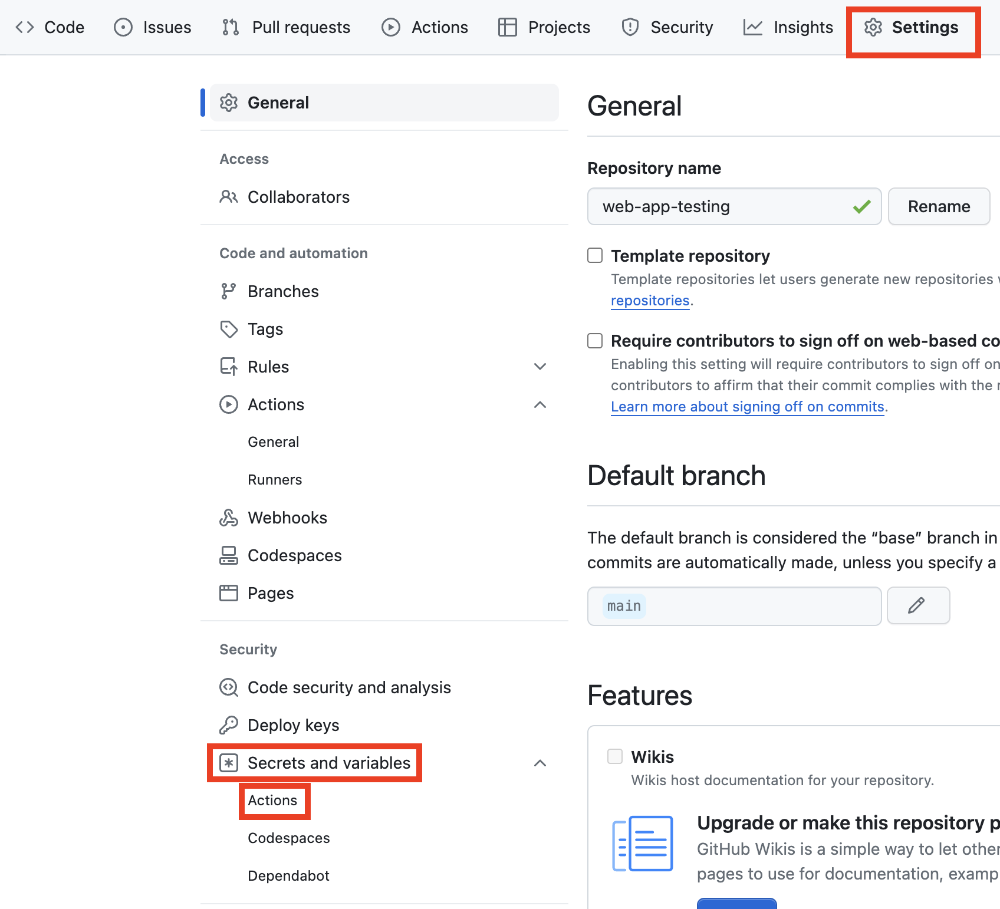
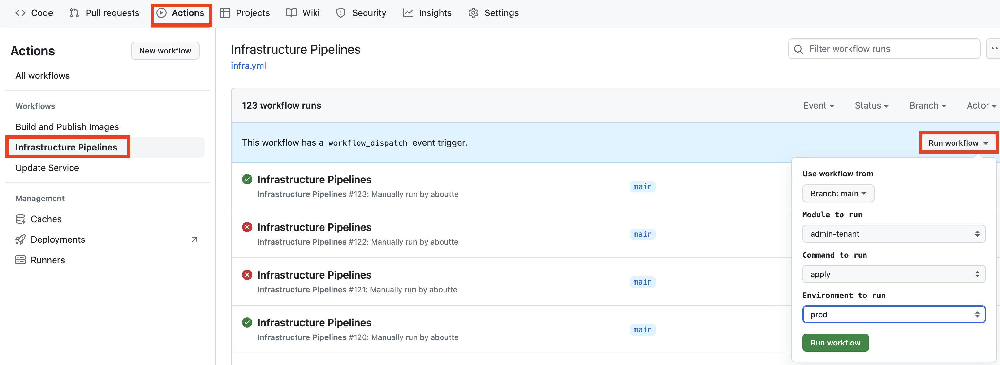
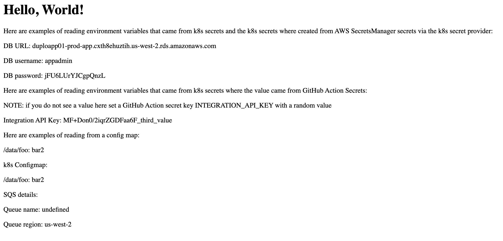

# 3 Tier Web Application AWS Reference Architecture

## Table of Contents

- [3 Tier Web Application AWS Reference Architecture](#3-tier-web-application-aws-reference-architecture)
  - [Table of Contents](#table-of-contents)
  - [Overview](#overview)
  - [Architecture Diagram](#architecture-diagram)
  - [Components](#components)
    - [Application](#application)
    - [Pipelines](#pipelines)
    - [Infrastructure as Code](#infrastructure-as-code)
  - [Deployment](#deployment)
    - [Assumption](#assumption)
    - [Create Repo](#create-repo)
    - [Configuration](#configuration)
    - [Deployment Steps](#deployment-steps)
      - [Infrastructure Pipelines - admin-tenant](#infrastructure-pipelines---admin-tenant)
      - [Infrastructure Pipelines - aws-services](#infrastructure-pipelines---aws-services)
      - [Build and Publish Iamges](#build-and-publish-iamges)
      - [Infrastructure Pipelines - app](#infrastructure-pipelines---app)
      - [Environment Validation](#environment-validation)
        - [Web Application](#web-application)
        - [Lambda](#lambda)
        - [k8s cronjob](#k8s-cronjob)
  - [Terraform Configuration](#terraform-configuration)
  - [Application Referencing Infrastructure](#application-referencing-infrastructure)
  - [License](#license)

## Overview

This project combines a sample application, pipelines, and infrastructure as code to stand up a reference architecture leveraging the DuploCloud Platform.

## Architecture Diagram



## Components

### Application

The application portion of this project consists of a Node application that will run in EKS, a k8s cronjob that schedules a container on an interval, and a python Lambda function.

### Pipelines

GitHub Actions it used for all pipelines.  The pipelines are broken down into three areas:

- Infra - This pipeline maps to the Terraform which is talked about in the following section
- Build and publish docker images
- Update environment to run new docker image versions

### Infrastructure as Code

Terraform is used for all Infrastructure as Code (IaC).  The Terraform is broken down into three modules:

- admin-tenant - This creates the DuploCloud Tenant.  Details about the DuploCloud Tenant can be found [here](https://docs.duplocloud.com/docs/getting-started/application-focussed-interface/tenant).
- aws-services - This creates all of the AWS Services to support the application (RDS, SQS, EKS worker nodes, etc)
- app - This deploys the application and provides all of the required configuration (environemnt variables, secrets, configmap etc)

The Terraform is written in a way where multiple environments (dev, qa, staging, production) can be created and maintained from the same Terraform project.  More on this in the Configuraiton section below.

Each Terraform module can be found under the `iac/terraform` directory and a REAADME has been provided to document all inputs and outputs ([admin-tenant](iac/terraform/admin-tenant/README.md), [aws-services](iac/terraform/aws-services/README.md), [app](iac/terraform/app/README.md)).

## Deployment

### Assumption

1) terraform version 1.5.5 or newer is required for local development
2) you have admin access to a DuploCloud environment to generate a long lived admin [DuploCloud Token](https://docs.duplocloud.com/docs/user-administration/access-control/api-tokens#creating-a-permanent-api-token)
3) you have a Duplocloud Infrastructure named "prod-infra" or you create a TF variables override file that updates the value of `infra_name`.  More on TF variable overrie files further down.
4) AWS ACM certificate added to the DuploCloud Plan that is assicated with the `infra_name`

### Create Repo

This GitHub project is a template project.  You can create your own GitHub repository, in your own GitHub Organization, by clicking on the green "Use this template" button and then "Create a new repository" option.



On the next page select a name for your repostiry, select public or private, and click "Create repository".

### Configuration

Once your GitHub repository is created we need to add some configuration at the repository level.  Click on "Settings", then "Secrets and variables", and then Actions.



Create the following secrets and environment variables:

| Type                | Key               | Value |
| ------------------- | ----------------- | ----- |
| Secret              | DUPLO_HOST        | Get [long lived token](https://docs.duplocloud.com/docs/user-administration/access-control/api-tokens#creating-a-permanent-api-token) from DuploCloud      |
| Environment Variale | DUPLO_HOST        | DuploCloud Platform host.  Example: https://salesdemo.duplocloud.net/ |
| Environment Variale | DUPLO_TENANT_BASE |  Name for your application in DuploCloud.  For testing use "app01"     |

### Deployment Steps

#### Infrastructure Pipelines - admin-tenant

The first deployment step is to create the DuploCloud Tenant. To start this pipeline click on Actions, Infrastructure Pipelines, Run workflow.

In the form for Module select admin-tenant, for Command select apply, and for Environment select prod then click Run workflow.

Once this pipeline has completed log into Duplo and review the list of Tenants.  You will see a new Tenant with the name "$DUPLO_TENANT_BASE-$ENVIRONMENT".  So assuming you selected "app01" for DUPLO_TENANT_BASE and "dev" for Environment your tenant name would be "app01-prod".  

You can repeat this step and select dev for Environment or move on to the next step. 



#### Infrastructure Pipelines - aws-services

Under the Infrastructure Piplines click Run workflow and in the form for Module select aws-services, for Command select apply, and for Environment select prod then click Run workflow.

#### Build and Publish Iamges

Now that the aws-services modules under Infrastructure Pipelines is complete we can build and publish our docker images.  This step must come after aws-services because aws-services includes the required ECR Repository.

Click on Actions, click on Build and Publish Images, click on Run workflow, leave all settings as their defaults, and click Run workflow.

#### Infrastructure Pipelines - app

Now that our docker images are published to the ECR repository it is time to deploy and configure the application.

Under the Infrastructure Piplines click Run workflow and in the form for Module select app, for Command select apply, and for Environment select prod then click Run workflow.

This step will deploy the frontend application to EKS, configure a k8s cronjob and create a Lambda function.  

#### Environment Validation

##### Web Application



##### Lambda

You can manualy invoke the Lambda function via the AWS console by following these steps:

1) DevOps
2) Serverless
3) Click the action menu for the demo function and click Console
4) Once in the AWS console click on the Test tab and click the Test button
5) You will see output like the following:

```json
{
  "message": "Database URL: duploapp01-prod-app.cxth8ehuztih.us-west-2.rds.amazonaws.com Database Username: appadmin Database Password: jFU6LUrYJCgpQnzL"
}
```

##### k8s cronjob

You can check the logs of any of the `completed` k8s cronjob pods and you will see log entries like the following:

```
Mon Feb 19 16:15:01 UTC 2024
Hello from the Kubernetes cluster
the database url is: duploapp01-prod-app.cxth8ehuztih.us-west-2.rds.amazonaws.com
```

You can check the environmetn variable configuration in DuploCloud at DevOps -> Containers -> EKS / Native -> k8s CronJob -> queue-processor.


## Terraform Configuration

To customize the infrastructure between the different environments (dev, qa, staging, production) you can create Terraform variables file under the following path:

```text
iac/terraform/$TERRAFORM_PROJECT/config/$DUPLO_TENANT_BASE-$ENVIRONMENT/$TERRAFORM_PROJECT.tfvars
```

TERRAFORM_PROJECT - one of admin-tenant, aws-services, app
DUPLO_TENANT_BASE - this is the value you set in the GitHub variables on the GitHub repostory
ENVIRONMENT - one of dev, qa, stage, prod

An example of this has been provided in `iac/terraform/aws-services/config/app01-prod/aws-services.tfvars` to increase the size of the AutoScaling group from 1 to 2 in the prod environment.

## Application Referencing Infrastructure

In this project there are several examples where the application needs to know details about the infrastructure.  The following list can be used as examples when adapting this project to your own application:

| Type                | Use Case          | Location |
|---------------------|-------------------|----------|
| k8s Secret              | The node application running in k8s needs access to RDS database credentials        |          |
| Environment Variale | The k8s cronjob needs access to the RS Database credentials, S3 bucket name, SQS queue name, and SQS queue region |          |
| AWS SecretsManager Secret | The Lambda function needs access to the RDS database credentials |          |
| k8s configmap | This shows an example of an application that needs access to a data file |          |

## License

See LICENSE file
